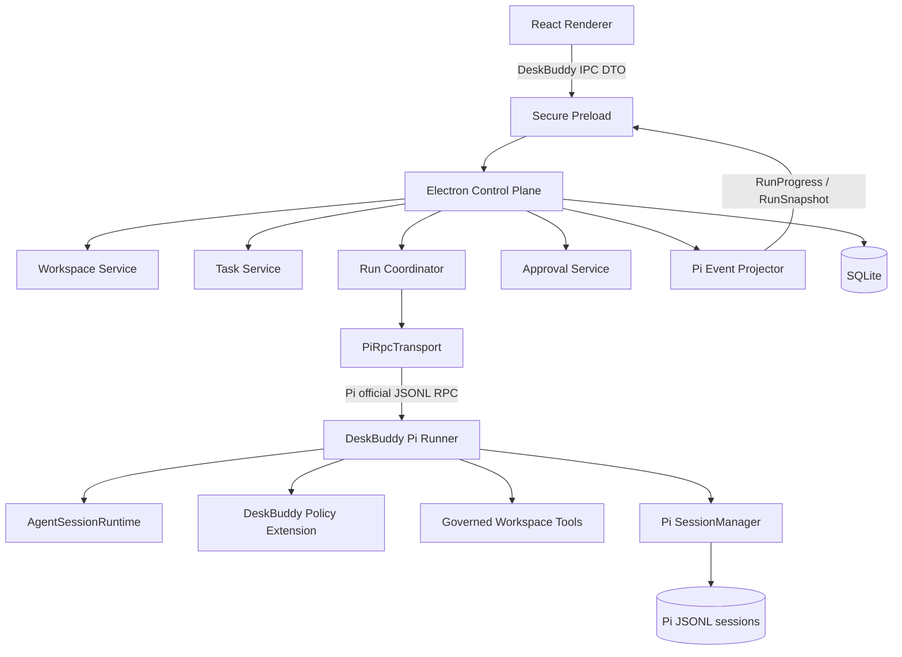
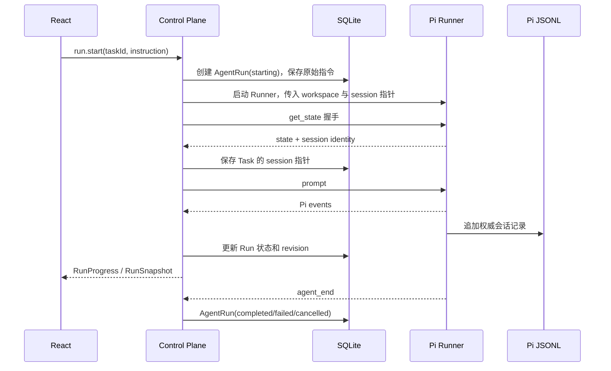

# DeskBuddy Pi Runner 架构设计

- 状态：待书面审阅
- 日期：2026-08-24
- Pi 基线：`0.84.2`
- 相关任务：[TASK-003](../../../tasks/TASK-003-pi-runner-architecture.md)
- 相关决定：[ADR-0001](../../../adr/0001-use-pi-as-agent-runtime.md)、[ADR-0003](../../../adr/0003-isolate-pi-in-runner.md)
- 可视化：[总体架构图](../../architecture/deskbuddy-pi-runner-architecture.svg)、[任务执行时序图](../../architecture/deskbuddy-task-execution-sequence.svg)

## 1. 目标

为 DeskBuddy 建立第一个可长期演进的本地 Agent 运行架构，使用户选择代码目录后，可以创建任务、运行 Pi、查看流式结果、取消执行，并在关闭应用后重新打开原来的工作区和任务。

本设计解决五个基础问题：

1. Pi 在 Electron 产品中的位置；
2. 本地工作区如何授权、保存和重新关联；
3. Pi 会话和 DeskBuddy 产品数据如何分工；
4. Tool、Extension 和凭据如何限制；
5. 运行崩溃、取消和应用重启后如何得到确定状态。

## 2. 非目标

本次设计不包含：

- 多 Agent 编排；
- 多个后台任务并行；
- 远程执行和跨设备同步；
- 任意第三方 Extension 市场；
- 无人值守自动任务；
- 办公连接器和公司私有系统；
- 写文件、Shell 和代码执行权限；
- Pi 实验性 client/server 的产品接入。

这些能力只有在单 Agent、单活动运行和只读工作区闭环通过验证后才重新评估。

## 3. 架构决定

DeskBuddy 采用“React Renderer + Electron Control Plane + 独立 Pi Runner”的三层本地架构。



依赖方向固定为：

```text
React → DeskBuddy IPC contracts → Electron Control Plane
Electron Control Plane → PiRpcTransport → Pi official RPC
Pi Runner → Pi public SDK
```

React 不依赖 Pi 包。业务服务不直接读写 Pi JSONL。Runner 不直接访问 DeskBuddy SQLite。

## 4. 组件职责

### 4.1 React Renderer

负责工作区、任务、对话时间线、审批卡片、产物和输入器。Renderer 运行在 `contextIsolation` 下，不拥有 Node.js 文件系统权限，也不能发送任意 Pi RPC 命令。

Renderer 只能调用 Preload 暴露的产品级操作，例如：

- `workspace.choose()`；
- `workspace.relink(workspaceId)`；
- `task.create(workspaceId, mode)`；
- `run.start(taskId, instruction)`；
- `run.cancel(agentRunId)`；
- `approval.resolve(approvalId, decision)`；
- `run.subscribe(agentRunId, listener)`。

### 4.2 Secure Preload

Preload 是 Renderer 的唯一系统能力入口。它校验 IPC 参数和返回值，只暴露窄接口，不暴露 `ipcRenderer`、文件路径操作、子进程或通用 RPC 转发。

### 4.3 Electron Control Plane

Control Plane 是产品状态和权限的控制者。

- `WorkspaceService`：保存授权目录、验证可用性并处理重新关联；
- `TaskService`：管理任务、模式、标题和 Pi 会话指针；
- `RunCoordinator`：保证活动运行和会话文件的独占所有权；
- `SessionLeaseService`：为 Pi 会话文件持有跨进程租约，拒绝第二个写入者；
- `RunnerSupervisor`：启动、监控、取消和终止 Runner；
- `ApprovalService`：保存待确认动作并返回用户决定；
- `PiEventProjector`：把 Pi 事件转换为产品进度和快照；
- `CredentialBroker`：向 Runner 提供当前执行需要的凭据，不把密钥放入命令行、Renderer 或普通日志；
- repositories：读写 SQLite 产品数据。

### 4.4 PiRpcTransport

`PiRpcTransport` 使用 Pi 官方 JSONL RPC 类型和命令，但实现产品级可靠性：

- 启动后发送 `get_state`，成功返回才标记 Runner 可用；
- 命令期限按类型配置，长时间命令不使用统一固定超时；
- 支持 `AbortSignal`；
- 支持 Extension UI request/response；
- 每一行必须通过 JSON 和消息 Schema 校验；
- 一个监听器失败不能阻断其他监听器；
- stderr、退出码和协议错误进入结构化 Runner 日志；
- 进程退出时拒绝全部未完成请求并通知 `RunCoordinator`。

该组件不改变 Pi 命令语义，也不把 DeskBuddy 业务字段写入 Pi 协议。

Runner 使用标准输入和标准输出承载 Pi JSONL RPC。凭据请求使用父子进程专用 IPC 通道，与 Agent 协议分离；该通道只接受固定的凭据请求和响应类型。

### 4.5 DeskBuddy Pi Runner

Runner 是独立 Node.js 子进程。它负责：

- 创建私有 `SettingsManager`、`DefaultResourceLoader` 和模型运行环境；
- 使用 `createAgentSessionServices` 和 `createAgentSessionRuntime` 托管 Pi；
- 加载指定 Task 的会话文件或创建新会话；
- 注册受控 Tool 和 DeskBuddy Policy Extension；
- 把 `session.agent.toolExecution` 设置为 `sequential`；
- 调用官方 `runRpcMode()`；
- 响应 Control Plane 的取消和退出。

Runner 不管理 Workspace、Task、Approval 或 Artifact 产品记录。

## 5. 运行与会话模型

### 5.1 三个产品实体

`Workspace` 表示用户授权的本地目录。`Task` 表示持续的用户目标和对话。`AgentRun` 表示用户提交一次指令后，从开始到稳定结束的一次执行。

一个 Task 对应一个 Pi 会话，可以包含多个按顺序发生的 AgentRun。V1 任意时刻全局最多一个 AgentRun 处于活动状态。

### 5.2 正常执行



### 5.3 Runner 生命周期

- 空闲 Task 不长期保留 Runner；
- 打开已有 Task 时可以启动临时 Runner，通过官方 `get_entries` 读取 Pi 会话并生成权威快照；只读恢复完成后退出，除非用户立即开始新的 AgentRun；
- 用户提交指令时启动 Runner；
- Runner 必须在握手成功后才能接收 prompt；
- 一次 AgentRun 稳定结束并完成持久化后，Runner 可以退出；
- 用户提交下一条指令时，用同一个 Task 的 Pi 会话文件启动新 Runner；
- 切换页面不会改变执行所有权；
- 启动其他 Task 时，如果已有活动 AgentRun，V1 明确拒绝并提示先完成或取消当前运行。

Electron 使用单实例锁阻止第二个 DeskBuddy Control Plane。Runner 在标准输入关闭或父进程 IPC 断开时立即取消当前执行并退出。打开 Pi 会话文件前还必须取得会话租约；租约包含随机 owner token、主进程 PID、Runner PID 和心跳时间。新进程只有在确认原 owner 已不存在后才能回收过期租约。

产品 V1 不直接暴露 Pi 的 `switch_session`、`new_session` 和 `fork`。需要新对话时创建新 Task；未来需要任务分支时再映射 Pi fork。

### 5.4 状态机

AgentRun 状态为：

```text
starting → running ↔ awaiting_approval
starting/running/awaiting_approval → cancelling → cancelled
running → completed
starting/running/awaiting_approval → failed
starting/running/awaiting_approval/cancelling → interrupted
```

- `failed`：Runner 正常报告了不可继续的执行错误；
- `cancelled`：用户取消且 Runner 已稳定结束；
- `interrupted`：应用或 Runner 意外退出，系统无法确认完整结束；
- `awaiting_approval`：执行仍归当前 Runner 所有，不允许启动另一个运行。

## 6. 持久化设计

### 6.1 应用私有目录

所有运行数据放在 Electron `app.getPath("userData")` 下：

```text
userData/
├── deskbuddy.db
├── pi/
│   ├── agent/                 # DeskBuddy 私有 agentDir
│   └── sessions/
│       └── <workspaceId>/     # Pi JSONL 会话
└── logs/
    └── runner/
```

Pi 会话文件不写入用户代码仓库。Renderer 不接收这些绝对存储路径。

### 6.2 SQLite 最小模型

#### Workspace

| 字段 | 含义 |
|---|---|
| `id` | 产品生成的稳定 ID |
| `displayName` | 侧栏显示名称 |
| `rootPath` | 用户明确选择的本地目录，仅主进程可见 |
| `status` | `available`、`missing` 或 `permission_denied` |
| `createdAt` / `lastOpenedAt` | 创建和最近打开时间 |

#### Task

| 字段 | 含义 |
|---|---|
| `id` | 稳定 ID |
| `workspaceId` | 所属工作区 |
| `title` | 用户可修改标题 |
| `mode` | `coding` 或 `office` |
| `piSessionId` | Pi 会话 ID，可为空 |
| `piSessionFile` | 应用私有目录中的会话文件，仅主进程可见 |
| `createdAt` / `updatedAt` | 创建和更新时间 |

#### AgentRun

| 字段 | 含义 |
|---|---|
| `id` | 一次执行的稳定 ID |
| `taskId` | 所属 Task |
| `instruction` | 本次用户原始指令，用于中断说明和明确重试 |
| `status` | AgentRun 状态 |
| `revision` | 产品快照版本，单调递增 |
| `piLeafIdBefore` / `piLeafIdAfter` | 本次运行前后的 Pi 会话叶节点，可为空 |
| `startedAt` / `endedAt` | 运行时间 |
| `errorCode` / `errorMessage` | 结构化错误和可展示说明 |

#### Approval

| 字段 | 含义 |
|---|---|
| `id` | 审批 ID |
| `agentRunId` / `toolCallId` | 所属运行和 Tool 调用 |
| `actionType` | 动作类型 |
| `summary` | 用户可读摘要 |
| `payloadHash` | 被批准参数的稳定摘要 |
| `status` | `pending`、`approved`、`rejected` 或 `aborted` |
| `requestedAt` / `resolvedAt` | 请求和处理时间 |

#### Artifact

| 字段 | 含义 |
|---|---|
| `id` | 产物 ID |
| `taskId` / `agentRunId` | 来源 |
| `kind` | 文件、报告或结构化结果类型 |
| `displayName` | 用户可读名称 |
| `workspaceRelativePath` | 工作区内相对路径，可为空 |
| `createdAt` | 创建时间 |

SQLite 不保存完整 Pi transcript，避免双写和恢复时产生两个权威来源。Control Plane 在 prompt 前后通过官方 `get_entries` 记录 Pi leaf ID，用它把 AgentRun 与 Pi 会话区间关联，而不是复制消息正文。

### 6.3 首次响应前崩溃

Pi 新会话通常在第一条助手响应开始后才写入 JSONL。因此 Control Plane 必须先事务性创建 `AgentRun(starting)` 并保存原始指令，再发送 prompt。

如果 Runner 在会话文件生成前退出：

- AgentRun 标记为 `interrupted`；
- Task 不伪装成可恢复的 Pi 会话；
- UI 显示原始指令并允许用户明确重试；
- 重试创建新的 AgentRun 和新 Pi 会话，不自动重放旧指令。

如果 JSONL 已存在，重新打开 Task 时从最后一个完整记录构建权威快照。系统不自动重放可能已经产生副作用的指令。

## 7. 工作区和路径安全

### 7.1 工作区保存

用户通过 Electron 原生目录选择器授权目录。Workspace 保存 `rootPath`。应用启动或打开 Workspace 时重新验证：

- 路径存在；
- 当前用户可访问；
- 路径类型是目录；
- 真实路径可以解析。

目录移动或删除时状态变为 `missing`，历史 Task 和会话仍然保留。用户选择新目录重新关联后，Runner 始终用新的 Workspace 根目录重建 cwd 相关服务，再加载原 Pi 会话；它不使用会话中保存的旧 cwd。产品 DTO 不暴露应用私有会话路径，历史消息中已经存在的工作区路径则作为会话内容保留。

### 7.2 Tool 边界

Pi 内置文件 Tool 支持绝对路径，因此不是工作区沙箱。V1 不开放内置 `read`、`edit`、`write` 和 `bash`，而是注册独立命名的只读 Tool：

- `workspace_list`：列出工作区内目录；
- `workspace_read`：读取工作区内允许的文本文件；
- `workspace_search`：在工作区内搜索文本和文件名。

每次 Tool 执行都必须：

1. 把输入解析为工作区相对路径；
2. 拒绝绝对路径和越级路径；
3. 解析目标及现有父目录的真实路径；
4. 检查符号链接和 Windows reparse point 后仍位于真实工作区根目录；
5. 在实际 I/O 前再次校验；
6. 限制单次读取大小、搜索结果数量和运行时间；
7. 返回结构化错误，不把本机无关绝对路径送入模型。

仅使用 Extension 的 `tool_call` 预检查不足以替代 Tool 内部检查，因为路径可能在检查和执行之间变化。

这是一条 Agent 能力边界，不是针对本机恶意进程的操作系统沙箱。Runner 仍继承当前用户权限；如果未来需要运行不受信任的第三方 Extension 或 Shell，必须增加 AppContainer、容器或等价的操作系统隔离，不能只扩展路径校验。

## 8. Extension、审批和凭据

### 8.1 资源加载

Runner 使用 DeskBuddy 私有 `agentDir`。`DefaultResourceLoader` 关闭自动发现的 Extension、Skill、Prompt Template 和 Theme，只加载产品显式注册的资源。

项目级 `AGENTS.md` 是否进入上下文由 Workspace 设置明确控制，不能因为用户全局 Pi 配置而自动继承。V1 默认允许读取当前工作区内的项目说明文件，但不加载用户主目录中的全局 Pi 上下文。

### 8.2 审批

DeskBuddy Policy Extension 可以在 `tool_call` hook 中阻止动作，并通过 RPC Extension UI `confirm` 请求用户决定。Control Plane 把请求转换为 Approval 记录和 UI 卡片。

V1 Tool 执行策略设为 `sequential`，同一时刻只处理一个 Tool 调用和一个审批。用户取消运行时，所有待处理审批转为 `aborted`，Extension 通过当前 AbortSignal 结束等待。

V1 只读 Tool 不要求逐次确认，但越界请求必须拒绝并审计。未来写操作必须形成包含目标、参数和内容摘要的 `ActionProposal`，用户批准后只能执行被批准参数的哈希对应动作。

### 8.3 凭据

Renderer 不接触模型密钥。Control Plane 的 `CredentialBroker` 从操作系统保护的存储读取凭据，并通过仅存在于父子进程生命周期内的受控通道提供给 Runner 的 `CredentialStore` 适配器。

凭据不得出现在：

- 命令行参数；
- 环境变量转储；
- Pi transcript；
- Renderer IPC DTO；
- Runner 普通日志；
- SQLite 普通字段。

## 9. 事件和前端状态

Pi 原始事件只在 Control Plane 内处理。`PiEventProjector` 产生两个产品类型：

```ts
type RunStatus =
  | "starting"
  | "running"
  | "awaiting_approval"
  | "cancelling"
  | "completed"
  | "failed"
  | "cancelled"
  | "interrupted";

type RunProgress =
  | {
      agentRunId: string;
      sequence: number;
      kind: "assistant_delta";
      messageId: string;
      delta: string;
    }
  | {
      agentRunId: string;
      sequence: number;
      kind: "tool_progress";
      toolCallId: string;
      toolName: string;
      phase: "started" | "updated" | "ended";
      summary: string;
    }
  | {
      agentRunId: string;
      sequence: number;
      kind: "status";
      status: RunStatus;
    };

type DeskBuddyMessage = {
  id: string;
  role: "user" | "assistant" | "tool";
  status: "streaming" | "complete" | "interrupted";
  content: readonly MessageContent[];
};

type MessageContent =
  | { kind: "text"; text: string }
  | { kind: "tool_call"; toolCallId: string; toolName: string; summary: string; status: "running" | "complete" | "failed" }
  | { kind: "tool_result"; toolCallId: string; summary: string; isError: boolean };

type ApprovalView = {
  id: string;
  actionType: string;
  summary: string;
};

type RunErrorCode =
  | "WORKSPACE_MISSING"
  | "WORKSPACE_PERMISSION_DENIED"
  | "WORKSPACE_PATH_ESCAPE"
  | "RUNNER_START_FAILED"
  | "RUNNER_CRASHED"
  | "RPC_PROTOCOL_ERROR"
  | "COMMAND_TIMEOUT"
  | "AUTH_REQUIRED"
  | "MODEL_ERROR"
  | "SESSION_CORRUPT"
  | "APPROVAL_ABORTED";

type RunError = {
  code: RunErrorCode;
  message: string;
  recoverable: boolean;
};

type RunSnapshot = {
  taskId: string;
  agentRunId: string;
  revision: number;
  status: RunStatus;
  messages: readonly DeskBuddyMessage[];
  pendingApproval: ApprovalView | null;
  error: RunError | null;
};
```

规则如下：

- `RunProgress` 是临时显示，不写入产品数据库；
- `message_end` 和运行状态变化产生新的 `RunSnapshot`；
- `revision` 在每个 AgentRun 内单调递增；
- Renderer 忽略低于当前 revision 的快照；
- 页面重新打开、Renderer 重载或事件丢失时请求完整快照；
- 应用内存中没有快照时，由临时 Runner 从 Pi JSONL 读取 entries，Projector 重建快照；Control Plane 不直接解析 Pi JSONL；
- Pi 版本字段变化只修改 Projector 和 Transport，不修改 React 组件协议。

## 10. 错误处理

Control Plane 使用稳定的产品错误码：

| 错误码 | 行为 |
|---|---|
| `WORKSPACE_MISSING` | 保留任务并要求重新关联目录 |
| `WORKSPACE_PERMISSION_DENIED` | 不启动 Runner，提示检查目录权限 |
| `WORKSPACE_PATH_ESCAPE` | 拒绝 Tool 调用并记录安全事件 |
| `RUNNER_START_FAILED` | AgentRun 置为 `failed`，保留原始指令 |
| `RUNNER_CRASHED` | AgentRun 置为 `interrupted`，从最后快照恢复显示 |
| `RPC_PROTOCOL_ERROR` | 终止 Runner，保存违规帧摘要而非敏感原文 |
| `COMMAND_TIMEOUT` | 先发送取消，宽限期后终止 Runner |
| `AUTH_REQUIRED` | 不把凭据问题交给模型，要求用户配置 Provider |
| `MODEL_ERROR` | 保存可展示错误和 Provider 错误类别 |
| `SESSION_CORRUPT` | 隔离会话文件，保留 Task 并提供新会话入口 |
| `APPROVAL_ABORTED` | 结束等待，不执行对应 Tool |

应用启动时，数据库中仍为活动状态但没有对应 Runner 的 AgentRun 一律转为 `interrupted`。系统不根据“最后一条消息看起来完成了”推断成功。

## 11. V1 测试策略

### 单元测试

- Workspace 路径规范化、越界、符号链接和 reparse point；
- AgentRun 状态转换和 revision；
- JSONL 编解码、Schema 校验和未完成请求清理；
- Pi 事件到 RunProgress/RunSnapshot 的投影；
- SQLite repository 和恢复查询；
- 会话租约的独占、心跳、断开和安全回收；
- Approval 取消和参数哈希。

### 进程集成测试

- 使用 faux provider 启动真实 Runner；
- 握手、prompt、流式事件和正常结束；
- 运行中取消；
- Runner 非零退出；
- 非法 JSONL；
- 首次响应前退出；
- 临时 Runner 从已有 Pi JSONL 重建权威快照后退出；
- 从已有 Pi JSONL 继续 Task；
- 第二个活动运行被明确拒绝。

### Renderer 测试

- 使用假的 Preload API，不启动 Pi；
- 工作区缺失和重新关联；
- 运行、取消、审批和中断状态；
- 快照 revision 防止旧状态覆盖新状态；
- Renderer 不依赖 Pi 类型。

所有自动化 Agent 测试使用 faux provider，不调用真实模型或付费接口。代码变更运行 `npm run check`；测试文件变更运行对应专项测试。

## 12. V1 模块边界

建议实施时采用以下目录，不在设计阶段提前创建空文件：

```text
src/
├── renderer/                   # React，只依赖 DeskBuddy contracts
├── preload/                    # 窄 IPC bridge
├── main/
│   ├── workspace/              # WorkspaceService + repository
│   ├── task/                   # TaskService + repository
│   ├── run/                    # RunCoordinator + RunnerSupervisor
│   ├── approval/               # ApprovalService
│   ├── pi/                     # PiRpcTransport + PiEventProjector
│   └── persistence/            # SQLite schema/migrations
├── runner/
│   ├── bootstrap.ts            # Pi runtime construction
│   ├── resources.ts            # private settings/resource loader
│   ├── policy-extension.ts     # tool hooks and approval bridge
│   └── tools/                  # governed workspace tools
└── shared/
    └── contracts/              # erasable TypeScript IPC DTOs
```

每个目录只通过公开接口与相邻层通信。`shared/contracts` 不导出 Pi 类型、Node 句柄或绝对会话路径。

## 13. 验收条件

本架构第一个实现切片完成时必须满足：

- 用户选过的目录在重启应用后仍显示；
- 目录不存在时历史 Task 不丢失，并可重新关联；
- 用户可以在代码工作区创建 Task 并完成一次只读 Pi 运行；
- 运行过程可以流式显示、取消并得到确定终态；
- 关闭并重开应用后，可以从 Pi JSONL 和 SQLite 恢复 Task；
- Runner 崩溃不会导致 Electron 主进程退出；
- Agent 无法通过 V1 暴露的 Tool 读取工作区外文件；
- 同一 Pi 会话不会被两个 Runner 同时写入；
- Renderer 不拥有文件系统、凭据或任意 Pi RPC 权限；
- faux provider 的正常、取消、崩溃和恢复测试通过。
